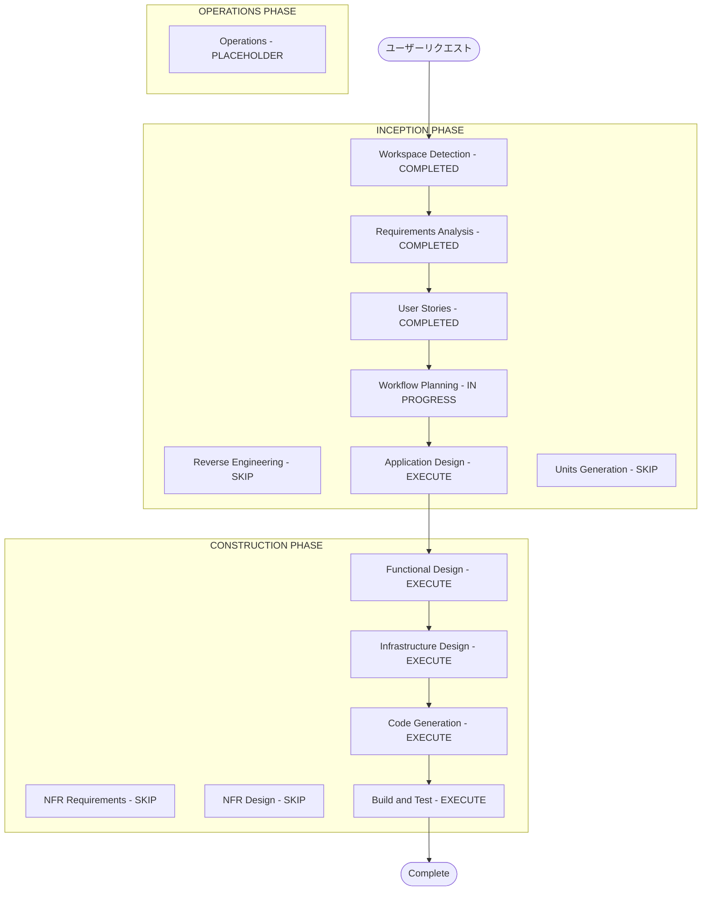

# Execution Plan — 部署内書籍管理アプリ

## 詳細分析サマリー

### 変更インパクト評価
- **ユーザー向け変更**: Yes — 全機能がユーザー対面のWebアプリ
- **構造的変更**: Yes — 新規アプリケーション（グリーンフィールド）
- **データモデル変更**: Yes — User / Book / Category / LoanRecord の新規設計
- **API変更**: Yes — REST API 全エンドポイント新規設計
- **NFRインパクト**: JWT認証 / Dockerコンテナ / PostgreSQL

### リスク評価
- **リスクレベル**: Low
- **ロールバック複雑度**: Easy（新規作成のため）
- **テスト複雑度**: Moderate（認証 + CRUD + 貸出フロー）

---

## ワークフロー可視化

---

## 実行フェーズ一覧

### INCEPTION PHASE
- [x] Workspace Detection — COMPLETED
- [x] Reverse Engineering — SKIP（グリーンフィールドのため）
- [x] Requirements Analysis — COMPLETED
- [x] User Stories — COMPLETED
- [ ] Workflow Planning — IN PROGRESS
- [ ] Application Design — EXECUTE
  - **理由**: 認証・書籍・貸出・カテゴリ・インポートの各コンポーネントとAPIの設計が必要
- [ ] Units Generation — SKIP
  - **理由**: 単一のWebアプリ。マイクロサービス分割は不要なため

### CONSTRUCTION PHASE（単一ユニット: book-manager）
- [ ] Functional Design — EXECUTE
  - **理由**: データモデル・ビジネスルール（貸出中本の削除禁止等）の詳細設計が必要
- [ ] NFR Requirements — SKIP
  - **理由**: 技術スタック（FastAPI/React/PostgreSQL/Docker/JWT）は要件定義で確定済み
- [ ] NFR Design — SKIP
  - **理由**: NFR要件が確定済みのため追加設計は不要
- [ ] Infrastructure Design — EXECUTE
  - **理由**: Docker Compose構成・PostgreSQL設定・コンテナネットワーク設計が必要
- [ ] Code Generation — EXECUTE（常時）
- [ ] Build and Test — EXECUTE（常時）

### OPERATIONS PHASE
- [ ] Operations — PLACEHOLDER

---

## 単一ユニット定義

**ユニット名**: `book-manager`  
**内容**: フロントエンド（React）+ バックエンド（FastAPI）+ DB（PostgreSQL）をまとめた単一ユニット  
**理由**: 小規模・単一チームで開発・単一デプロイ（Docker Compose）

---

## 推定タイムライン
- **総フェーズ数**: 5（Application Design / Functional Design / Infrastructure Design / Code Generation / Build and Test）
- **スキップフェーズ数**: 4（Reverse Engineering / Units Generation / NFR Requirements / NFR Design）

## 成功基準
- **主要目標**: Docker Compose で起動できる書籍管理Webアプリの完成
- **主要成果物**:
  - FastAPI バックエンド（認証 + CRUD + 貸出管理 + インポート）
  - React フロントエンド
  - PostgreSQL スキーマ + Alembic マイグレーション
  - docker-compose.yml
  - ユニットテスト + 統合テスト
